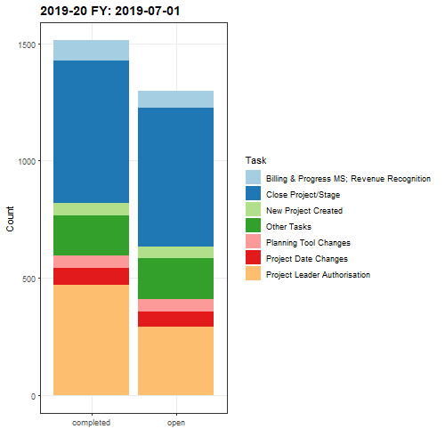

```{r setup, include=FALSE}
knitr::opts_chunk$set(
  results = 'asis',
  echo = FALSE,
  warning = FALSE,
  message = FALSE,
  fig.align = 'center'
)

#Load libraries
library(tidyverse)
library(gganimate)
library(gifski)
library(gridExtra)
library(kableExtra)
```


# Introduction
Introduce *yourself*. What's your background? Could you code before Data School? What did your 
daily work pattern look like before Data School? Etc. This section will be placed in 
an introductory block at the top of the page separate from the rest of the content. Don't change the section title from "Introduction" otherwise this process won't work correctly.

# My Project
Rather than yourself, this is the space to introduce your **project**. What are 
your goals, what is your data, how do you plan to work with it? Perhaps show some example data if 
it would help.

In order to build this demo poster correctly, you will also need to have installed the `tidyverse`, 
`gapminder`, and `kableExtra` packages.

**TEXT HERE DETAILING BACKGROUND OF PROJECT, ISSUES WITH MANUAL PROCESS, DUPLICATION/HUMAN ERROR ETC. text text text text text text text text text text text text text text text text text text text text text text text text text text text text text text text text text text text text text text**

** !! Include an image of what the report looked like on the original spreadsheet**

{width=100px}

## Preliminary results

This section will demonstrate the different visuals you might want use to show off your 
project. Don't feel the need to go overboard, this is supposed to give a taste of the work you are
doing rather than being a publication ready document.

To get tables formatting correctly, use `knitr::kable` to convert the table to html format. If
you also want to have alternate row highlighting, pass the result to `kable_styling('striped')` 
from the `kableExtra` package.


** This is a test version of a table generated from data **

```{(Code text here)}```

```{r}

# Read in final report summary. This has been duplicated from the data/outputs directory in the R project and put into the Markdown directory: resources/final.csv.

PSC_bind <- read_csv("resources/final.csv")

# Tibbles for generation of plots: 1) Open PSC tasks; 2) Completed PSC tasks; 3) Combined PSC tasks.

PSC_open_gathered <-  
  select(PSC_bind, -3,-5,-7,-9,-11,-13,-15,-16:-18) %>% 
  rename("Planning Tool Changes" = MPTC_open, 
         "New Project Created" = MNPC_open,
         "Project Leader Authorisation" = MPLA_open,
         "Other Tasks" = MOT_open,
         "Billing & Progress MS; Revenue Recognition" = MBPM_RR_open,
         "Close Project/Stage" = MCPS_open,
         "Project Date Changes" = MPDC_open) %>% 
  gather(2:8 , key = 'Task', value = 'n') %>% 
  mutate(Status = "open")

PSC_comp_gathered <- 
  select(PSC_bind, -2,-4,-6,-8,-10,-12,-14,-16:-18) %>% 
  rename("Planning Tool Changes" = MPTC_comp, 
         "New Project Created" = MNPC_comp,
         "Project Leader Authorisation" = MPLA_comp,
         "Other Tasks" = MOT_comp,
         "Billing & Progress MS; Revenue Recognition" = MBPM_RR_comp,
         "Close Project/Stage" = MCPS_comp,
         "Project Date Changes" = MPDC_comp) %>% 
  gather(2:8, key = 'Task', value = 'n') %>% 
  mutate(Status = "completed")

PSC_combined <- full_join(PSC_open_gathered, PSC_comp_gathered)

# Rearranged tibble for long data summary (Open PSC Tasks) for visualisation as a table.

PSC_open_long <-  
  select(PSC_bind, -3,-5,-7,-9,-11,-13,-15,-16:-18) %>% 
  rename("Planning Tool Changes" = MPTC_open, 
         "New Project Created" = MNPC_open,
         "Project Leader Authorisation" = MPLA_open,
         "Other Tasks" = MOT_open,
         "Billing & Progress MS; Revenue Recognition" = MBPM_RR_open,
         "Close Project/Stage" = MCPS_open,
         "Project Date Changes" = MPDC_open) %>% 
  gather(2:8, key = 'Task', value = 'n') %>% 
  spread(1, key = 'month', value = 'n') %>% 
  arrange(Task) %>% 
  rename("2019-20 FY" = Task,
         "Jul" = `2019-07-01`,
         "Aug" = `2019-08-01`,
         "Sep" = `2019-09-01`,
         "Oct" = `2019-10-01`,
         "Nov" = `2019-11-01`,
         "Dec" = `2019-12-01`,
         "Jan" = `2020-01-01`,
         "Feb" = `2020-02-01`,
         "Mar" = `2020-03-01`,
         "Apr" = `2020-04-01`,
         "May" = `2020-05-01`,
         "Jun" = `2020-06-01`) 

# generate a table of Open PSC Tasks based on the long data tibble.

knitr::kable(head(PSC_open_long, n = 7), format = "html", caption = "Open PSC tasks: 2019-20 FY") %>% 
  kable_styling("striped")

```


**Acutal text to follow: below is a chart detailing Open PSC tasks for FY 2019-20. text text text text text text text text text text text text text text text text text text text text text text text text text text text text text text text text text text text text text text**

```{r standard-plot, out.width='80%', fig.align='left', fig.height= 4, fig.width=8, fig.cap="Open PSC tasks: 2019-20 FY"}

PSC_open <- PSC_open_gathered %>% 
  ggplot(aes(x = month, y = n, fill = Task)) +
  geom_col() +
  scale_fill_brewer(palette = "Paired") +
  labs(
    title = "Open PSC tasks: 2019-20 FY (up to Apr-20)",
    x = "Month",
    y = "Count",
    colour = "Task"
  ) + 
  theme_bw() +
  theme(
    panel.grid.minor = element_blank(),
    plot.title = element_text(face = "bold")
  ) 

PSC_open <- PSC_open +
  theme(axis.text.x = element_text(angle = 50, size = 10, vjust = 0.5))

PSC_open


```

Here's an animation of the above chart. I think the animated aspect lends greater insight into the work volume over the course of the year and indicates particular trends.

This animation incorporates transition_time() and shadow_mark() functions, whilst an ease_aes() function smooths the transitions. The timing of the animation is controlled further by rendering the animation using the animate() function.

{height=400px, width=800px}

Whilst this animation details both Open and Completed PSC Tasks from month-to-month over the 2019-20 FY. I'm not entirely sure how informative it is at this stage. However, it could definitely be improved by fixing the date stamp and replacing this with the name of the month instead.

{height=500px, width=500px}


///////////////////////////////////////////////////


Your figure and table captions are automatically numbered and can be referenced in the text
if needed: see eg. Table \@ref(tab:mytable) and Figure \@ref(fig:standard-plot)

# My Digital Toolbox

What digital tools have you been using in your project? Do you expect that everything will be able 
to be completed within R, or will you need to work with multiple tools to get the right result?
Which of the digital skills needed for your project have you learned since starting Data School?

You can use all the usual R markdown features in writing a project summary, including lists:

* R - dplyr, ggplot, ...
* Python
* SQL

## Favourite tool (optional)

Is there a tool/package/function in particular that you've enjoyed using? Give it a special shout out here. What about this tool makes it your favourite?

{.pull-right width=100px}

No prizes for guessing mine:

# My time went ...

What parts of your project take the most time and effort? Were there any surprising challenges you
encountered, and how did you solve them?

# Next steps

What further steps do you wish your project could take? Or are there any new digital skills that you
are keen to develop as a result of your involvement in the Data School?

# My Data School Experience

This summary is mostly about your project. However we would also like to hear about other
parts of your Data School experience. What aspects of the program did you really enjoy? Have you
tried applying the skills you have learned in your daily work? Have you been able to transfer this 
knowledge to your team members? Any descriptions of the personal impact the program has 
had are welcome here as well!

# Thank you: